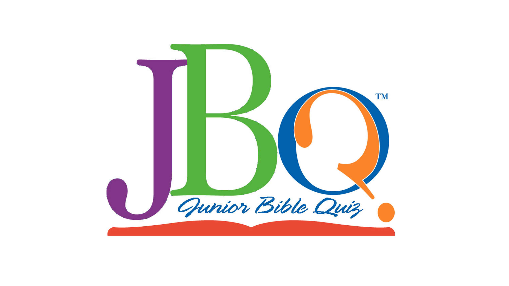

# CSE110 Lab Week 1
>"All of us do not have equal talent. But, all of us have an equal opportunity to develop our talents."    
<br>
&nbsp;&nbsp;&nbsp;&nbsp;&nbsp;&nbsp;&nbsp;&nbsp;&nbsp;&nbsp;&nbsp;&nbsp;&nbsp;&nbsp;&nbsp;&nbsp;&nbsp;&nbsp;&nbsp;&nbsp;&nbsp;&nbsp;&nbsp;&nbsp;&nbsp;&nbsp;&nbsp;&nbsp;&nbsp;&nbsp;&nbsp;&nbsp;&nbsp;&nbsp;&nbsp;&nbsp;&nbsp;&nbsp;&nbsp;&nbsp;&nbsp;&nbsp;&nbsp;&nbsp; -Dr. A.P.J. Abdul Kalam

### Table of Contents
1. [Introduction](#about-me)

2. [Technical Skills](#programming-skills)

3. [Extracurricular Activities](#hobbies--experience)


## **About Me**:
Hi there! I am Steve Padmanaban,
second-year student at UC San Diego. I am currently majoring in Math & Computer Science. My passion for Computer Science sparked at a small age when curious about how computers are influencing humanity.

By high school, I further expanded this interest by taking CS courses and developing multi-tier projects which focus on real life applications of CS principles in industries such as healthcare and finance. These projects are located in my [Github](https://www.github.com/spadmanaban25) which contains the repositories of them.


<br>
<br>
<br>

## **Programming Skills**
I have experience with some of the most popular and robust programming languages when creating the projects as well as from classes that I have taken. These langauges include:

* Java
* C
* C++
* Python
* Javascript
* HTML/CSS
* SQL Server
* ARM Assembly

Programming languages such as Java and Python have different syntaxes in which programmers new to one language or the other would at first mix up syntaxes. For example, here is how to write an if statement both in Java and Python:

```
Java:             
                    
int x = 5;
if (x > 1) {
    x *= 2;
} else {
    x--;
}   

Python:                
x = 5
if x > 1:
    x *= 2
else:                         
    x--;

```
<br><br>
## **Hobbies & Experience**
I play 2 musical instruments: the piano and saxophone since I was in middle school, and was awarded Superior Rating for [Solo Ensemble](https://fba.flmusiced.org/mpa/state-solo-ensemble/) for the Tenor Saxophone. For my pastime, I play sports such as basketball and tennis. I am an avid car fan, and like to keep up with the lateset car trends. 

I served at my church, Christian Life Center, as a Quizmaster in the [Junior Bible Quiz Program](https://kidmin.ag.org/ministries/JBQ/overview). I led officials, coaches, and quizzers during South Florida League Junior Bible Quiz matches and served as an official in the 2019 National Junior Bible Quiz matches in Tucson, AZ.



